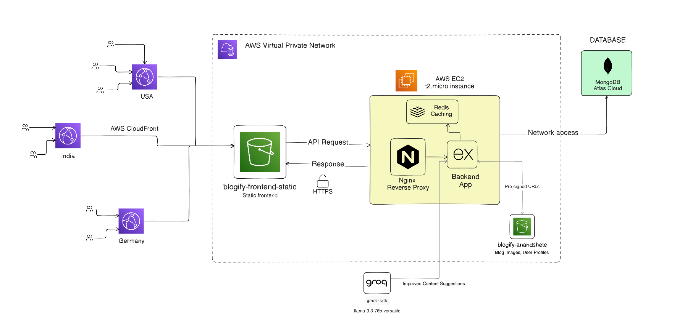

# Blogify

Blogify is a full-stack blogging platform that enables users to create, share, and discover content with a focus on performance, security, and scalable architecture.

## System Design

Blogify's **current production architecture** uses AWS with a focus on low-latency content delivery and efficient resource utilization.<br><br>


## High-Level Flow

- Static assets are served via **AWS CloudFront** (CDN) backed by an **S3 bucket**
- API requests are routed to a backend hosted on **EC2**, behind an **Nginx reverse proxy**
- **Redis** is used to cache frequently accessed blog data on landing page.
- **MongoDB Atlas** handles persistent storage
- Media uploads are handled via **S3 pre-signed URLs**, avoiding backend load
- **GROQ API** is integrated for AI-assisted content enhancement

## Live Demo

If you directly want to view this project:
<a href="https://blogify.anandshete.dev" target="_blank">Blogify</a>

## Features

- **Optimized Content Delivery** using Redis caching and CloudFront CDN
- **AI-Assisted Writing** with Groq API integration
- **Authentication** via Email/Password and Google OAuth
- **Secure Media Uploads** using S3 pre-signed URLs
- **API Protection** with rate limiting and input sanitization
- **Pagination** for scalable blog discovery

## Tech Stack

- **Frontend**: React, Redux, Tailwind, ShadCN
- **Backend**: Express, JWT, CORS, Sanitize-HTML, AWS SDK
- **Database**: MongoDB Atlas
- **Caching**: Redis
- **Cloud & Infra**: AWS S3, CloudFront, EC2, Nginx
- **AI Integration**: `groq-sdk`

## Local Development

### Prerequisites

- Node.js (v20+ recommended)
- MongoDB setup locally
- AWS account (configured IAM and S3 services)
- Redis installed locally
- Google Geimini API key
- Google OAuth credentials
- TinyMCE API key

### Setup

1. Clone the repository

```bash
git clone https://github.com/anand-shete/blogify
cd blogify
```

2. Install dependencies

```bash
cd frontend
npm install
cd ../backend
npm install
```

3. Set up environment variables

Create a `.env` file in the `backend` directory and add following variables

```bash
MONGO_URI=your_MONGO_URI
PORT=3000
JWT_SECRET_KEY=your_JWT_SECRET_KEY
REDIS_URI=your_REDIS_URI
FRONTEND_URL=your_FRONTEND_URL

AWS_ACCESS_KEY_ID=your_ACCESS_KEY
AWS_SECRET_ACCESS_KEY=your_SECRET_ACCESS_KEY
BUCKET_NAME=your_BUCKET_NAME

GOOGLE_CLIENT_ID=your_GOOGLE_CLIENT_ID
GOOGLE_CLIENT_SECRET=your_GOOGLE_CLIENT_SECRET
GOOGLE_REDIRECT_URI=your_GOOGLE_REDIRECT_URI
SESSION_KEY=your_SESSION_KEY

GROQ_API_KEY=your_GROQ_API_KEY
```

Create a .env file in the `frontend` directory with following variables

```bash
VITE_BASEURL=http://localhost:3000/api/v1
VITE_TINYMCE_API_KEY=your_TINYMCE_API_KEY
```

4. Start the server

In the `backend` directory, run script

```bash
npm run dev
```

In a new terminal, navigate to `frontend` directory

```bash
npm run dev
```

5. Verify

If you followed all the above steps properly, you should see

```bash
Redis connected successfully
MongoDB connected
🚀 Server started on http://localhost:3000
```

## Containerize with Docker

### Prerequisites

- Docker
- Docker Compose

### Setup

1. Create a `.env.production` file in backend directory and add your backend production environment variables:

```sh
PORT=3000
JWT_SECRET_KEY=your_JWT_SECRET_KEY
FRONTEND_URL=your_FRONTEND_URL

AWS_ACCESS_KEY_ID=your_ACCESS_KEY
AWS_SECRET_ACCESS_KEY=your_SECRET_ACCESS_KEY
BUCKET_NAME=your_BUCKET_NAME

GOOGLE_CLIENT_ID=your_GOOGLE_CLIENT_ID
GOOGLE_CLIENT_SECRET=your_GOOGLE_CLIENT_SECRET
GOOGLE_REDIRECT_URI=your_GOOGLE_REDIRECT_URI
SESSION_KEY=your_SESSION_KEY

GROQ_API_KEY=your_GROQ_API_KEY
```

2. Create a `.env.production` in same directory as `compose.yaml` and paste following variables:

```sh
VITE_API_URI=/api/v1
VITE_TINYMCE_API_KEY=your_VITE_TINYMCE_API_KEY
```

These variables are injected during the frontend Docker build process.

3. Spin up the stack using Docker Compose

```sh
docker compose up --build
```

This command:

- builds frontend and backend images
- starts nginx, backend, MongoDB, and Redis containers
- creates internal Docker networking automatically
- reverse proxies request from frontend to backend automatically using Nginx

4. Verify deployment

Visit

```sh
http://localhost:4173
```

You should see the Blogify frontend running successfully.
